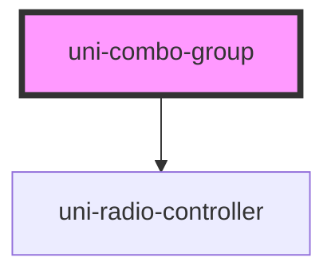

# uni-combo-group

<!-- Auto Generated Below -->

## Properties

| Property  | Attribute | Description                                                                   | Type                  | Default     |
| --------- | --------- | ----------------------------------------------------------------------------- | --------------------- | ----------- |
| `value`   | `value`   | Value of the selected option                                                  | `string`              | `undefined` |
| `variant` | `variant` | Display a different style radio group, either a "combo" row or "button" group | `"button" \| "combo"` | `'combo'`   |

## Shadow Parts

| Part       | Description |
| ---------- | ----------- |
| `"layout"` |             |

## Dependencies

### Depends on

- [uni-radio-controller](../uni-radio-controller)

### Graph

----------------------------------------------

*Built with [StencilJS](https://stenciljs.com/)*
