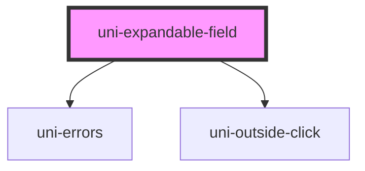

# uni-expandable-field

<!-- Auto Generated Below -->

## Properties

| Property      | Attribute      | Description                               | Type                 | Default     |
| ------------- | -------------- | ----------------------------------------- | -------------------- | ----------- |
| `disabled`    | `disabled`     | Makes the field disabled and unselectable | `boolean`            | `undefined` |
| `displayText` | `display-text` | Display text inside the trigger           | `string`             | `undefined` |
| `errors`      | `errors`       | Displays errors below the input           | `string \| string[]` | `''`        |
| `label`       | `label`        | Label text above the field                | `string`             | `undefined` |
| `optional`    | `optional`     | Displays a visual (optional) marker       | `boolean`            | `false`     |

## Dependencies

### Depends on

- [uni-errors](../../uni-errors)
- [uni-outside-click](../../util/uni-outside-click)

### Graph

----------------------------------------------

*Built with [StencilJS](https://stenciljs.com/)*
