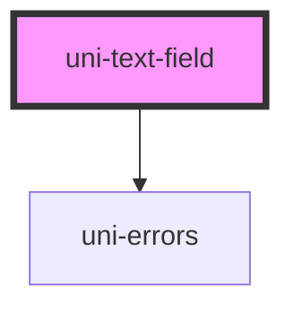

# uni-text-field

<!-- Auto Generated Below -->

## Properties

| Property      | Attribute     | Description                                                             | Type                 | Default     |
| ------------- | ------------- | ----------------------------------------------------------------------- | -------------------- | ----------- |
| `disabled`    | `disabled`    | Makes the field disabled and unselectable                               | `boolean`            | `undefined` |
| `errors`      | `errors`      | Displays errors below the input                                         | `string \| string[]` | `''`        |
| `label`       | `label`       | Label text above the field                                              | `string`             | `undefined` |
| `labelSlot`   | `label-slot`  | Alternatively, use a <slot> inside the label to render custom contents. | `boolean`            | `false`     |
| `max`         | `max`         | Maximum value when the input is in number mode                          | `number`             | `undefined` |
| `maxlength`   | `maxlength`   | Maximum string length                                                   | `number`             | `undefined` |
| `min`         | `min`         | Minimum value when the input is in number mode                          | `number`             | `undefined` |
| `minlength`   | `minlength`   | Minimum string length                                                   | `number`             | `undefined` |
| `optional`    | `optional`    | Displays a visual (optional) marker                                     | `boolean`            | `false`     |
| `placeholder` | `placeholder` | Placeholder displayed inside the field                                  | `string`             | `undefined` |
| `readonly`    | `readonly`    | Prevents editing the field, but allows selecting text                   | `boolean`            | `undefined` |
| `required`    | `required`    | Marks the input as required                                             | `boolean`            | `undefined` |
| `type`        | `type`        | Type for the underlying <input> or "textarea" to switch out the element | `string`             | `undefined` |
| `value`       | `value`       | Set the value of the field                                              | `string`             | `undefined` |

## Events

| Event       | Description                                | Type                  |
| ----------- | ------------------------------------------ | --------------------- |
| `uniChange` | Emitted when form field value is committed | `CustomEvent<string>` |
| `uniInput`  | Emitted when the form field value changes  | `CustomEvent<string>` |

## Dependencies

### Depends on

- [uni-errors](../../uni-errors)

### Graph

----------------------------------------------

*Built with [StencilJS](https://stenciljs.com/)*
