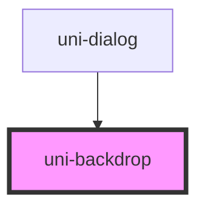

# uni-backdrop

<!-- Auto Generated Below -->

## Properties

| Property   | Attribute  | Description                                                                           | Type      | Default |
| ---------- | ---------- | ------------------------------------------------------------------------------------- | --------- | ------- |
| `tappable` | `tappable` | If `true`, the backdrop will can be clicked and will emit the `uniBackdropTap` event. | `boolean` | `true`  |
| `visible`  | `visible`  | If `true`, the backdrop will be visible.                                              | `boolean` | `true`  |

## Events

| Event            | Description                          | Type                |
| ---------------- | ------------------------------------ | ------------------- |
| `uniBackdropTap` | Emitted when the backdrop is tapped. | `CustomEvent<void>` |

## Dependencies

### Used by

 - [uni-dialog](../uni-dialog)

### Graph

----------------------------------------------

*Built with [StencilJS](https://stenciljs.com/)*
