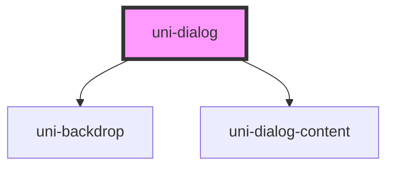

# uni-dialog

<!-- Auto Generated Below -->

## Properties

| Property          | Attribute          | Description                                                                            | Type      | Default |
| ----------------- | ------------------ | -------------------------------------------------------------------------------------- | --------- | ------- |
| `backdropDismiss` | `backdrop-dismiss` | Controls whether clicking on the backdrop will dismiss the dialog                      | `boolean` | `true`  |
| `keyboardClose`   | `keyboard-close`   | If `true`, the keyboard will be automatically dismissed when the overlay is presented. | `boolean` | `true`  |

## Events

| Event            | Description                             | Type                                   |
| ---------------- | --------------------------------------- | -------------------------------------- |
| `uniDidDismiss`  | Emitted after the alert has dismissed.  | `CustomEvent<OverlayEventDetail<any>>` |
| `uniDidPresent`  | Emitted after the alert has presented.  | `CustomEvent<void>`                    |
| `uniWillDismiss` | Emitted before the alert has dismissed. | `CustomEvent<OverlayEventDetail<any>>` |
| `uniWillPresent` | Emitted before the alert has presented. | `CustomEvent<void>`                    |

## Methods

### `dismiss(data?: any, role?: string) => Promise<boolean>`

Dismiss the alert overlay after it has been presented.

#### Returns

Type: `Promise<boolean>`

### `present() => Promise<void>`

Present the alert overlay after it has been created.

#### Returns

Type: `Promise<void>`

## Dependencies

### Depends on

- [uni-backdrop](../uni-backdrop)
- [uni-dialog-content](uni-dialog-content)

### Graph

----------------------------------------------

*Built with [StencilJS](https://stenciljs.com/)*
