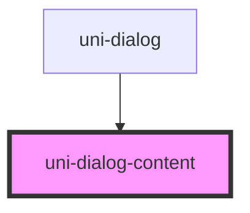

# uni-dialog-content

<!-- Auto Generated Below -->

## Properties

| Property  | Attribute | Description                           | Type      | Default |
| --------- | --------- | ------------------------------------- | --------- | ------- |
| `shaking` | `shaking` | Whether to play the shaking animation | `boolean` | `false` |

## Dependencies

### Used by

 - [uni-dialog](..)

### Graph

----------------------------------------------

*Built with [StencilJS](https://stenciljs.com/)*
