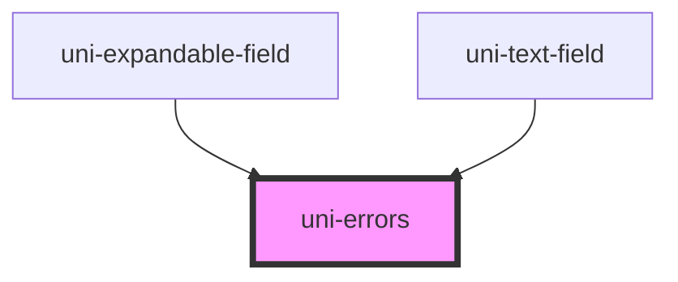

# uni-errors

<!-- Auto Generated Below -->

## Properties

| Property | Attribute | Description                                           | Type                 | Default     |
| -------- | --------- | ----------------------------------------------------- | -------------------- | ----------- |
| `error`  | `error`   | Display a single error Will be overridden by errors[] | `string`             | `undefined` |
| `errors` | `errors`  | Displays a list of errors. Will override error        | `string \| string[]` | `undefined` |

## Dependencies

### Used by

 - [uni-expandable-field](../forms/uni-expandable-field)
 - [uni-text-field](../forms/uni-text-field)

### Graph

----------------------------------------------

*Built with [StencilJS](https://stenciljs.com/)*
