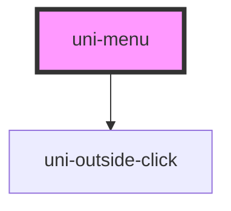

# uni-menu

<!-- Auto Generated Below -->

## Properties

| Property | Attribute | Description                           | Type      | Default |
| -------- | --------- | ------------------------------------- | --------- | ------- |
| `open`   | `open`    | Programmatically set the menu as open | `boolean` | `false` |

## Dependencies

### Depends on

- [uni-outside-click](../util/uni-outside-click)

### Graph

----------------------------------------------

*Built with [StencilJS](https://stenciljs.com/)*
