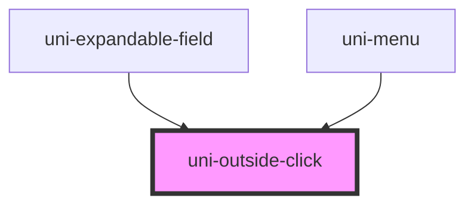

# uni-outside-click

<!-- Auto Generated Below -->

## Properties

| Property | Attribute | Description                                                                                      | Type                       | Default     |
| -------- | --------- | ------------------------------------------------------------------------------------------------ | -------------------------- | ----------- |
| `root`   | --        | Specify a root to listen on, anything "outside" this will trigger. Useful for escaping shadowDOM | `HTMLElement \| undefined` | `undefined` |

## Events

| Event             | Description                                            | Type                      |
| ----------------- | ------------------------------------------------------ | ------------------------- |
| `uniOutsideClick` | Emitted when the document is clicked outside this tree | `CustomEvent<MouseEvent>` |

## Dependencies

### Used by

 - [uni-expandable-field](../../forms/uni-expandable-field)
 - [uni-menu](../../uni-menu)

### Graph

----------------------------------------------

*Built with [StencilJS](https://stenciljs.com/)*
