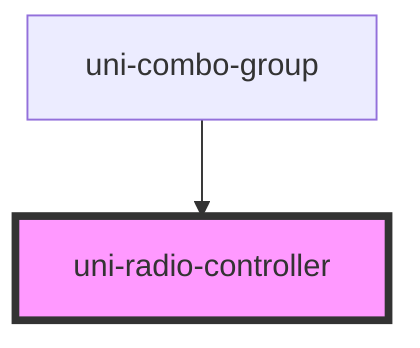

# uni-radio-controller

<!-- Auto Generated Below -->

## Properties

| Property | Attribute | Description                  | Type     | Default     |
| -------- | --------- | ---------------------------- | -------- | ----------- |
| `value`  | `value`   | Value of the selected option | `string` | `undefined` |

## Events

| Event       | Description                              | Type                  |
| ----------- | ---------------------------------------- | --------------------- |
| `uniChange` | Emitted when the selected option changes | `CustomEvent<string>` |

## Dependencies

### Used by

 - [uni-combo-group](../../forms/uni-combo-group)

### Graph

----------------------------------------------

*Built with [StencilJS](https://stenciljs.com/)*
